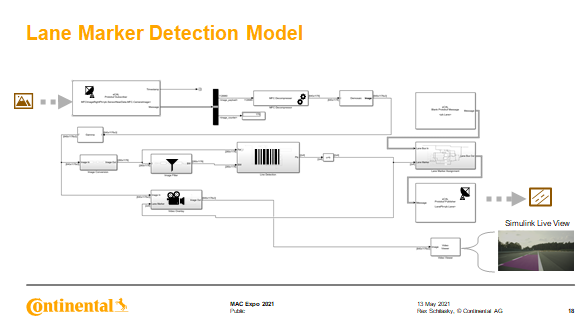
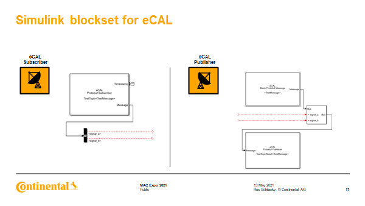

# eCAL Toolbox for Simulink 
[eCAL](https://github.com/eclipse-ecal/ecal) - enhanced Communication Abstraction Layer enables scalable, high performance interprocess communication in heterogenous networks. It is based on a publish/subscribe pattern, designed for minimal latency and high data throughput, leveraging UDP or shared memory as the transport layer for best performance. Thanks to its lightweight C/C++ API, eCAL has been integrated into Simulink as an open-source toolbox for simulation on desktop and prototyping on Speedgoat’s real-time target computers, providing a flexible and high performant multi-node communication layer.

# How to get started on desktop
1. Install the latest eCAL Release availabe for your OS from [here](https://github.com/eclipse-ecal/ecal/releases).
2. To leverage UDP, please set your multicast routes as shown [here](https://eclipse-ecal.github.io/ecal/getting_started/cloud.html).
3. Open eCAL Monitor.
4. Start a first MATLAB instance and run the model `ecal_helloworld_snd`.
5. Start a second MATLAB instance and run the model `ecal_helloworld_rec`.

Please notice that the message counter of eCAL subscriber only increases if you run a matching publisher which has the same topic name and is not part of the same process.

# How to get started for real-time simulation with Simulink Real-Time™ on Speedgoat® target computers
## Build and preparation steps for QNX® RTOS
1. Initialize and check out Git submodules.
2. Build eCAL libraries for QNX:
    - Use the script `buildeCALlibs4QNX.cmd` to build eCAL libraries for QNX® on Windows.
    - Use the script `buildeCALlibs4QNX.sh` to build eCAL libraries for QNX® on Linux.
    - Call `buildeCALlibs4QNX` from the object `eCALutils` within MATLAB.
3. Copy the libraries from `_install_qnx/lib` to the target. For this purpose, create an `eCALutils` object and call the method `installLibsOnSpeedgoat`.
4. Patch Fast-RTPS libraries with `patchFastRTPSLibs` from the class eCALutils.

## Setting up eCAL route on QNX®
Run `setMulticast4ECAL`. Routes are restored to default after every target reboot. Therefore, you must add the eCAL route after booting the target, whenever you want to use eCAL with the external UDP communication.

## Check eCAL communication between Speedgoat® target and host (optional)
1. Log into QNX® over SSH and run a send sample, for instance `ecal_sample_person_snd`.
2. On the host computer, open eCAL Monitor, and you should see the Speedgoat sending the messages. If you don't see them, please review your route and firewall settings on the host. Also, you may use WireShark to inspect the network communication.

## Run test model on Speedgoat®
Open and use the "Run on Target" button on the Real-Time ribbon to build, deploy and run the real-time application on the Speedgoat target. If you are using the eCAL Monitor on the host, you should be able to see the incoming messages. Otherwise, please check the network configuration as shown above.

# Cloud configuration
Don’t forget to set your multicast routes and make sure your hostname resolution works on all machines!

## Getting started
Please read the following documentation about [UDP Multicast routes](https://eclipse-ecal.github.io/ecal/getting_started/cloud.html#getting-started-cloud) at [eCAL Documentation](https://eclipse-ecal.github.io/ecal/index.html).
